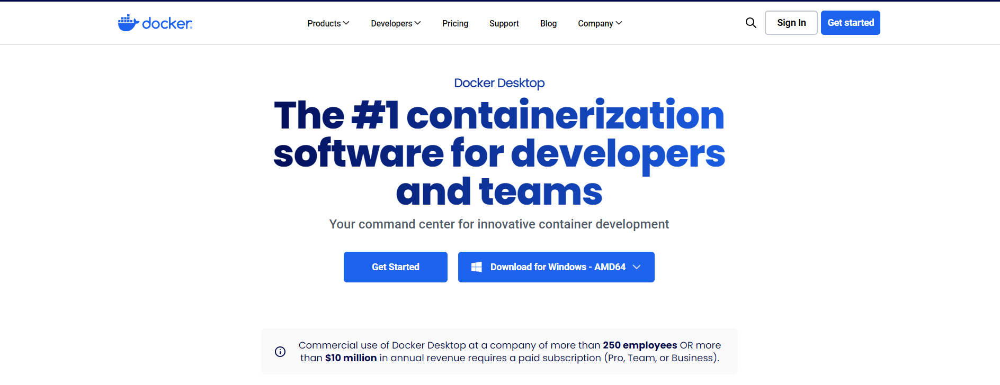
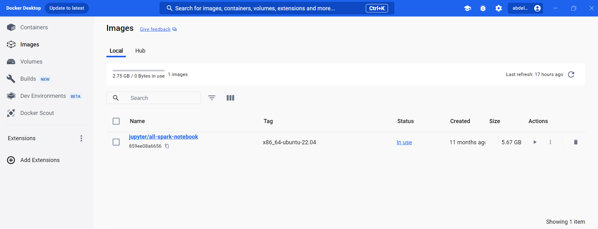
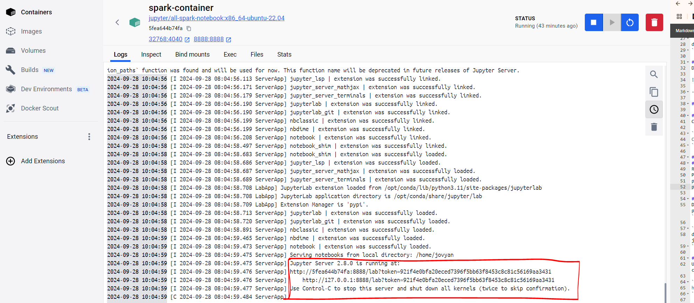

# Introduction à PySpark avec Docker et Jupyter Notebook

Ce guide vous montrera comment configurer **PySpark** avec **Docker** et **Jupyter Notebook** sur une machine Windows. Nous allons :
- Installer Docker Desktop
- Télécharger l'image `jupyter/all-spark-notebook`
- Créer un conteneur avec le port 8888 et monter un dossier local

## 1. Installation de Docker Desktop sur Windows

### Étape 1 : Télécharger Docker Desktop
Rendez-vous sur le [site officiel de Docker](https://www.docker.com/products/docker-desktop) et téléchargez Docker Desktop pour Windows.



### Étape 2 : Installer Docker Desktop
- Lancez l'exécutable téléchargé et suivez les étapes d'installation.
- Assurez-vous que la virtualisation est activée sur votre machine (si ce n'est pas déjà fait).
- Une fois installé, ouvrez Docker Desktop.

---

## 2. Télécharger l'image `jupyter/all-spark-notebook`

### Étape 1 : Ouvrir un terminal
Dans Docker Desktop ou via un terminal (PowerShell ou Git Bash), exécutez la commande suivante pour télécharger l'image Docker contenant PySpark et Jupyter Notebook :

```bash
docker pull jupyter/all-spark-notebook
```

### Étape 2 : Vérifier l'image téléchargée
Dans Docker Desktop, cliquez sur l'onglet **Images** pour vérifier que l'image a bien été téléchargée.



---

## 3. Créer un conteneur pour PySpark

### Étape 1 : Créer un dossier local pour le conteneur
Créez un dossier sur votre bureau où seront stockés vos fichiers PySpark :

```
C:\Users\<ton_nom>\Desktop\spark\container
```

### Étape 2 : Lancer le conteneur
#### Sur Docker Desktop
Remplir les infos sur les path et les ports : <br>
Port : `8888` <br>
path container : `/home/jovyan/work`<br>
path local : `C:\Users\<ton_nom>\Desktop\spark\container`<br>

#### Via le terminal
Dans le terminal, exécutez la commande suivante pour démarrer un conteneur Docker avec Jupyter et PySpark. Le port 8888 sera utilisé pour accéder à Jupyter, et le dossier local sera monté dans le conteneur à `/home/jovyan/work`.

```bash
docker run -p 8888:8888 -v C:/Users/<ton_nom>/Desktop/spark/container:/home/jovyan/work jupyter/all-spark-notebook
```

### Étape 3 : Accéder à Jupyter Notebook
Une fois le conteneur lancé, une URL avec un token unique sera générée. Vous pouvez accéder à Jupyter Notebook en copiant cette URL dans votre navigateur :

```
http://127.0.0.1:8888/?token=<votre_token_unique>
```



---

## 4. Accéder et utiliser PySpark dans Jupyter

- Après avoir accédé à Jupyter Notebook via l'URL, vous pouvez créer un nouveau notebook Python et commencer à écrire du code PySpark.

### Exemple de code PySpark dans un Notebook

```python
from pyspark.sql import SparkSession

# Créer une session Spark
spark = SparkSession.builder.appName("test").getOrCreate()

# Exemple de données
data = [("Alice", 34), ("Bob", 45), ("Cathy", 29)]
df = spark.createDataFrame(data, ["Name", "Age"])

# Afficher les données sous forme de DataFrame
df.show()
```

---


## Conclusion

Vous êtes maintenant prêt à utiliser PySpark avec Jupyter dans un environnement Docker ! Les notebooks créés dans Jupyter seront accessibles dans votre dossier local `C:\Users\<ton_nom>\Desktop\spark\container`.
